# SkyNode

> AI-assisted flight discovery and trip planning for fast, affordable getaways.

[](https://react.dev/)
[](https://www.typescriptlang.org/)
[](https://vite.dev/)
[](https://expressjs.com/)
[](https://supabase.com/)

SkyNode is a full-stack travel web application for discovering flights, exploring affordable destinations, planning itineraries with AI assistance, and saving trips with collaborative context. It combines flight search, destination boards, maps, saved trips, account profiles, and an assistant-first planning flow into one travel companion.

Live app: [https://sky-node-three.vercel.app/](https://sky-node-three.vercel.app/)

---

## Table of Contents

- [Features](#features)
- [Tech Stack](#tech-stack)
- [Application Flow](#application-flow)
- [Project Documentation](#project-documentation)
- [Architecture](#architecture)
- [Project Organization](#project-organization)
- [API Surface](#api-surface)
- [Environment Variables](#environment-variables)
- [Install](#install)
- [Usage](#usage)
- [Deployment](#deployment)
- [Known Limitations](#known-limitations)
- [Repository Structure](#repository-structure)
- [Project Status](#project-status)

## Features

- Flight search with city and airport autocomplete.
- Destination discovery boards for low-fare route ideas.
- Interactive destination map with city markers, destination images, fare cards, and carousel filtering.
- AI travel assistant for itinerary questions, budget adjustments, honeymoon planning, relaxed routes, food ideas, and saved-trip context.
- Trip planner with attractions, day-by-day itinerary generation, editable plans, and trip saving.
- Saved trips, joined trips, invite links, trip visibility settings, and member/chat support.
- Account page with profile management, travel mission progress, and trip statistics.
- Live flights radar powered by OpenSky, with production traffic routed through a Cloudflare Tunnel proxy when Vercel cannot reach OpenSky reliably.
- Supabase authentication with email signup, OAuth sign-in, password recovery, and server-side account deletion.

## Tech Stack

### Frontend

- React 19
- TypeScript
- Vite
- React Router
- Tailwind CSS
- Leaflet and marker clustering
- D3, TopoJSON, and world-atlas for map/profile visualization
- Lucide React icons

### Backend

- Node.js
- Express
- TypeScript
- PostgreSQL via `pg`
- Supabase Auth and Supabase-backed trip/account workflows

### External Services

- Travelpayouts for cached flight deal data
- ScrapingBee/Kayak provider path for live flight search experiments
- Geoapify for attractions
- OpenRouteService for route directions
- OpenSky Network for aircraft telemetry, optionally reached through a Cloudflare Tunnel proxy in production
- Gemini or Ollama for AI itinerary/chat generation
- Wikipedia/Wikimedia for destination imagery

## Application Flow

### 1. Discover Flights

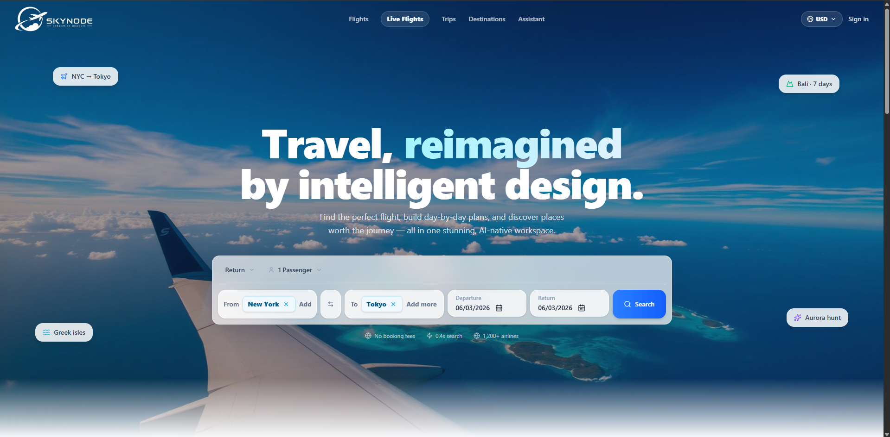

Users start from the landing page by choosing where they want to fly, comparing trip ideas, and moving into flight search or planning.

### 2. Explore Affordable Destinations

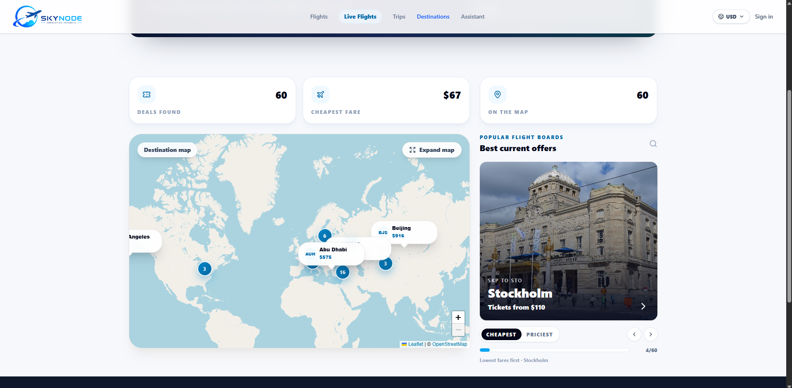

The Destinations page helps users pick a departure city, browse cheap route ideas, shift between cheapest and priciest offers, and inspect destination cards on the map.

### 3. Plan the Trip

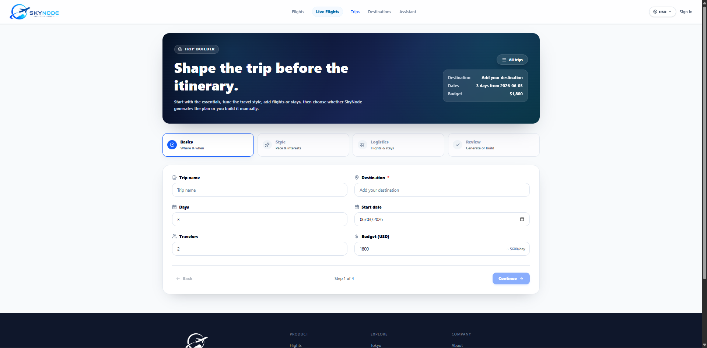

After selecting a route, users can generate a day-by-day itinerary, review attractions, adjust plans, and save the trip.

### 4. Refine With the AI Assistant

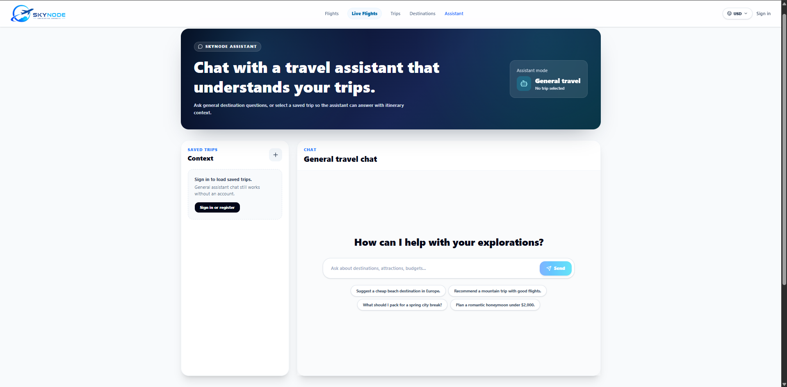

The assistant supports destination questions, budget changes, honeymoon planning, food recommendations, relaxed itineraries, and saved-trip context.

### 5. Save and Share Trips

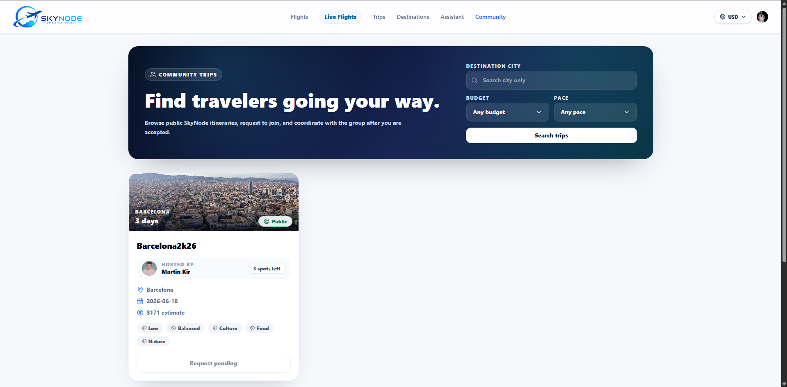

Registered users can save private or public trips, browse community trips, invite members, request to join shared trips, and continue planning collaboratively.

## Project Documentation

The repository includes supporting project documents and diagrams for presentation, review, and thesis-style documentation.

### Word Documents

- [SkyNode User Manual](docs/SkyNode_User_Manual.docx)
- [SkyNode Technical Documentation](docs/SkyNode_Technical_Documentation.docx)
- [SkyNode System Limitations](docs/SkyNode_System_Limitations.docx)
- [SkyNode Future Improvements](docs/SkyNode_Future_Improvements.docx)
- [SkyNode SonarQube Report](docs/SkyNode_SonarQube_Report.docx)

### Diagrams

#### Use Case Diagram

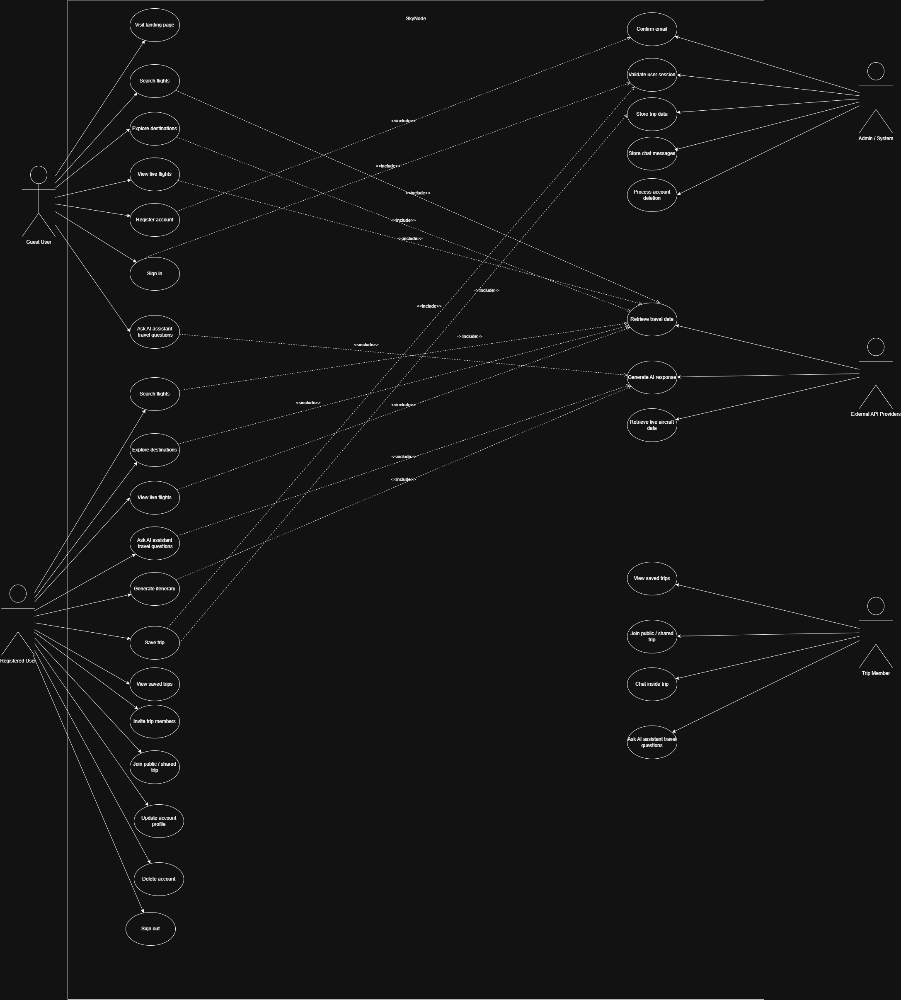

#### System Structure Diagram

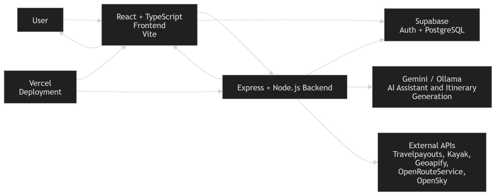

#### Database Schema Diagram

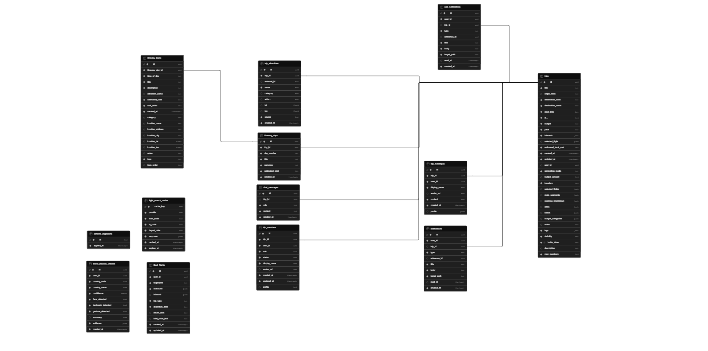

#### Sequence Diagram

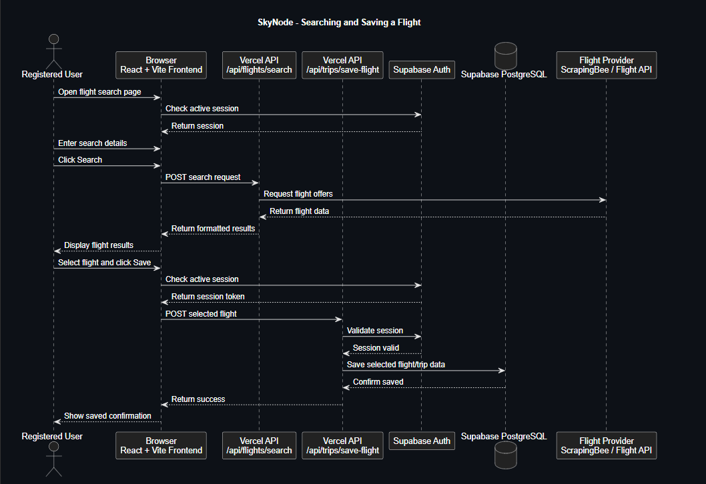

#### Activity Diagram

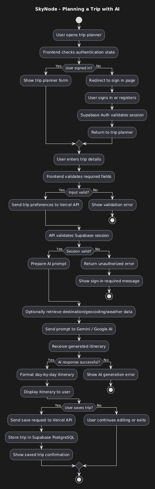

#### Deployment Diagram

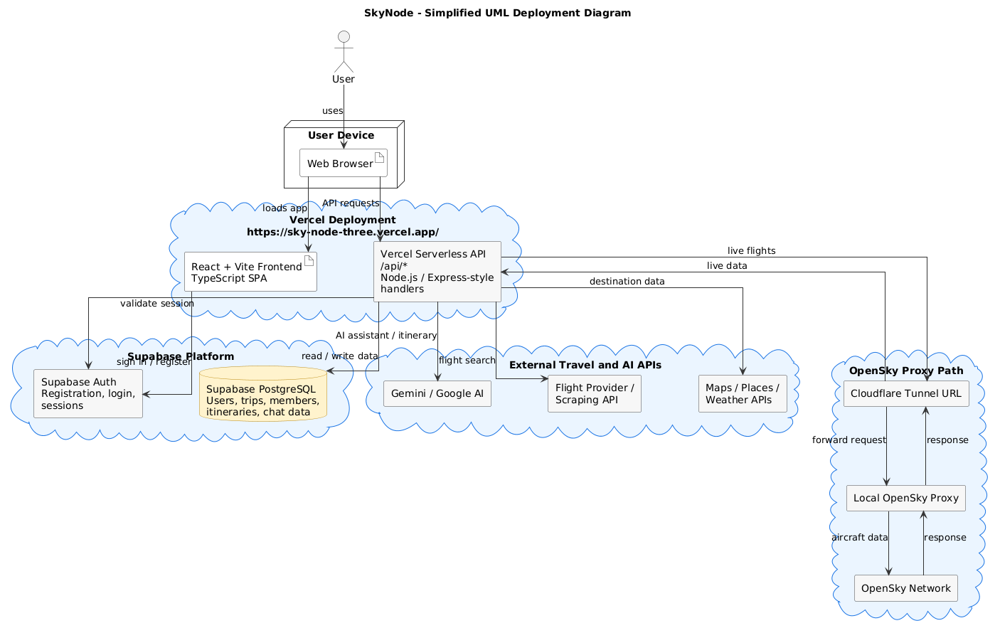

## Architecture

SkyNode is organized as a single TypeScript repository with a Vite frontend and an Express backend. The frontend talks to backend routes under `/api/*`. On Vercel, the static client is served from `dist/public`, while API requests are handled by the serverless entry in `api/[...path].ts`.

The backend keeps route adapters thin and delegates feature logic into modules, providers, and infrastructure clients. Shared request and response types live in `src/shared` so the frontend and backend stay aligned.

### Project Architecture

The application is split into four main parts:

- **Client application:** React pages, reusable UI components, API clients, authentication state, maps, forms, and trip planning screens. The client is responsible for user interaction, route navigation, rendering search results, showing destination boards, and displaying AI/trip workflows.
- **Server API:** Express routes exposed through Vercel serverless functions. This layer validates requests, protects authenticated endpoints, coordinates provider calls, and returns JSON responses to the browser.
- **Domain modules:** Feature-specific backend logic for trips, chat, account workflows, notifications, missions, geocoding, live flights, and itinerary generation. This keeps business logic separate from HTTP route wiring.
- **External services:** Supabase, Gemini/Ollama, Travelpayouts, ScrapingBee/Kayak experiments, Geoapify, OpenRouteService, Wikimedia, and OpenSky. The app treats these services as replaceable providers behind internal API routes.

This structure was chosen so the frontend never calls sensitive providers directly. Public browser code uses only safe keys such as the Supabase anon key, while server-only credentials stay inside Vercel environment variables.

### Data Architecture

SkyNode uses Supabase/PostgreSQL as the main persistent data layer. Authentication identity comes from Supabase Auth, while application data is stored through backend repositories and shared with the client through typed API responses.

The main data areas are:

- **Users and profiles:** Supabase Auth stores identity and sessions; profile/account workflows connect authenticated users to application features.
- **Trips:** Saved trips contain trip metadata, generated itinerary content, visibility settings, owner information, members, join requests, invite links, and chat context.
- **Liked flights and planning state:** Users can save flight options and reuse them in planning flows.
- **Community data:** Public trips, joined trips, membership state, and trip messages are accessed through authenticated API routes.
- **Provider data:** Flight offers, destination imagery, map data, attractions, directions, weather, and live aircraft positions are fetched from external providers and treated as transient data unless the user saves a trip or flight.

Sensitive data is kept server-side. The client receives only the data needed for the current UI screen, and authenticated operations pass through backend middleware before reading or writing Supabase data.

### Architectural Decisions

- **React + Vite frontend:** Chosen for fast development, reusable component structure, and efficient production builds.
- **TypeScript across frontend and backend:** Chosen to reduce mismatches between API responses, shared domain types, and UI state.
- **Single repository:** Chosen because the project is a bachelor-project prototype with one deployable product. Keeping frontend, backend, shared types, docs, and scripts together makes development and review simpler.
- **Express API wrapped by Vercel serverless routes:** Chosen so the same backend app can run locally with Node and in production through Vercel. This avoids maintaining separate local and deployed API implementations.
- **Supabase for authentication and data:** Chosen to provide email/OAuth authentication, managed PostgreSQL storage, and a practical production-ready backend service without building a custom auth system.
- **Server-side provider calls:** Chosen because API keys and scraping/provider credentials must not be exposed in browser JavaScript.
- **Cloudflare Tunnel proxy for OpenSky:** Chosen because OpenSky requests from Vercel can time out or be blocked. The deployed app still exposes `/api/live-flights` on Vercel, but upstream OpenSky traffic can be routed through a controlled proxy tunnel.
- **External AI provider abstraction:** Chosen so Gemini can be used in production while Ollama remains available for local experimentation.

## Project Organization

The project work was organized with a lightweight Scrum process from **01.05.2026 to 06.06.2026**. Work was split into four sprints, with progress tracked through the repository, task/backlog notes, documentation updates, and regular Microsoft Teams calls for planning and review.

| Sprint | Dates | Main focus |
|--------|-------|------------|
| Sprint 1 | 01.05.2026 - 10.05.2026 | Requirements, feature scope, first UI structure, initial architecture, database planning |
| Sprint 2 | 11.05.2026 - 20.05.2026 | Flight search, destination discovery, authentication, map-based pages |
| Sprint 3 | 21.05.2026 - 31.05.2026 | AI assistant, trip planner, saved/community trips, Supabase workflows |
| Sprint 4 | 01.06.2026 - 06.06.2026 | Vercel deployment, OpenSky proxy tunnel, testing, documentation, diagrams, final polish |

The work process followed this rhythm:

- Define and prioritize backlog items before each sprint.
- Implement features in small commits and verify them locally.
- Review progress and blockers through Microsoft Teams calls.
- Adjust the scope when external services caused deployment or timeout issues.
- Document architecture, diagrams, limitations, and future improvements before final delivery.

## API Surface

- `GET /api/places`
- `GET /api/flights`
- `GET /api/liked-flights`
- `POST /api/liked-flights`
- `DELETE /api/liked-flights/:id`
- `GET /api/explore`
- `GET /api/live-flights`
- `GET /api/attractions`
- `POST /api/geocode`
- `GET /api/geocode/cities`
- `POST /api/directions`
- `POST /api/itineraries/generate`
- `GET /api/trips`
- `POST /api/trips`
- `GET /api/trips/public`
- `GET /api/trips/joined`
- `GET /api/trips/:tripId`
- `POST /api/trips/:tripId/join`
- `GET /api/trips/:tripId/messages`
- `POST /api/trips/:tripId/messages`
- `POST /api/chat`
- `DELETE /api/account`
- `GET /api/notifications/unread`
- `POST /api/travel-missions/submit`

## Environment Variables

Create a local `.env` file. Do not commit it.

```env
# Flight providers
API_KEY=your_scrapingbee_key
SCRAPINGBEE_API_KEY=your_scrapingbee_key
TRAVELPAYOUTS_ACCESS_TOKEN=your_travelpayouts_token
TRAVELPAYOUTS_CURRENCY=USD

# Maps and places
GEOAPIFY_API_KEY=your_geoapify_key
OPENROUTESERVICE_API_KEY=your_openrouteservice_key

# Supabase
DATABASE_URL=your_supabase_postgres_pooler_url
VITE_SUPABASE_URL=https://your-project-ref.supabase.co
VITE_SUPABASE_ANON_KEY=your_supabase_anon_key
VITE_SUPABASE_AVATAR_BUCKET=profile-avatars
SUPABASE_SECRET_KEY=your_server_only_supabase_service_role_key

# Public app URL
VITE_PUBLIC_SITE_URL=https://sky-node-three.vercel.app

# AI provider
LLM_PROVIDER=gemini
GEMINI_API_KEY=your_google_ai_studio_key
GEMINI_MODEL=gemini-2.5-flash
GEMINI_API_URL=https://generativelanguage.googleapis.com/v1beta
GEMINI_THINKING_BUDGET=0
GEMINI_TIMEOUT_MS=120000

# Optional local AI provider
OLLAMA_BASE_URL=http://localhost:11434
OLLAMA_MODEL=llama3:latest
OLLAMA_TIMEOUT_MS=300000

# Optional live flights
OPENSKY_API_URL=https://opensky-network.org/api
OPENSKY_TOKEN_URL=https://auth.opensky-network.org/auth/realms/opensky-network/protocol/openid-connect/token
OPENSKY_CLIENT_ID=your_opensky_client_id
OPENSKY_CLIENT_SECRET=your_opensky_client_secret
OPENSKY_USE_AUTH=false
OPENSKY_PROXY_SECRET=only_needed_when_using_the_cloudflare_tunnel_proxy
OPENSKY_AUTH_TIMEOUT_MS=2500
OPENSKY_TIMEOUT_MS=8500
```

`VITE_SUPABASE_ANON_KEY` is safe for the browser. `SUPABASE_SECRET_KEY` is not safe for the browser and must never be exposed with a `VITE_` prefix.

Profile pictures are stored in Supabase Storage. Create a public bucket named `profile-avatars` or set `VITE_SUPABASE_AVATAR_BUCKET` to your bucket name. Authenticated users need permission to upload and update files under their own user-id folder.

Recommended Storage policies for `storage.objects`:

```sql
create policy "Public avatar read"
on storage.objects for select
using (bucket_id = 'profile-avatars');

create policy "Users upload own avatar"
on storage.objects for insert
to authenticated
with check (bucket_id = 'profile-avatars' and (storage.foldername(name))[1] = auth.uid()::text);

create policy "Users update own avatar"
on storage.objects for update
to authenticated
using (bucket_id = 'profile-avatars' and (storage.foldername(name))[1] = auth.uid()::text)
with check (bucket_id = 'profile-avatars' and (storage.foldername(name))[1] = auth.uid()::text);

create policy "Users delete own avatar"
on storage.objects for delete
to authenticated
using (bucket_id = 'profile-avatars' and (storage.foldername(name))[1] = auth.uid()::text);
```

For Supabase email confirmation in production, configure:

- Site URL: `https://sky-node-three.vercel.app`
- Redirect URLs: `https://sky-node-three.vercel.app/*`

## Install

```powershell
npm install
```

## Usage

Build and run the production server locally:

```powershell
npm run build
npm start
```

Open:

```text
http://localhost:3000
```

Run the development server with Vite hot reload:

```powershell
npm run dev
npm run dev:web
```

Open:

```text
http://localhost:5173
```

If using Ollama locally, pull the configured model first:

```powershell
ollama pull llama3:latest
```

## Deployment

SkyNode is configured for Vercel:

- Build command: `npm run build`
- Output directory: `dist/public`
- API function: `api/[...path].ts`
- SPA fallback rewrite to `index.html`

Required production environment variables should be added in Vercel Project Settings. Never upload `.env` to Git.

### OpenSky proxy tunnel for production

Live flight requests always enter the app through Vercel at `/api/live-flights`. In production, the backend can then forward the upstream OpenSky request through a small local proxy exposed with Cloudflare Tunnel. This avoids the Vercel-to-OpenSky timeout/blocking issue while keeping the public app URL unchanged.

**Local development (`npm run dev`):** do not use the tunnel. Your machine talks to OpenSky directly through the default `OPENSKY_API_URL`. Set the tunnel URL only in **Vercel** for the deployed site, unless you are testing the proxy itself.

1. Install [cloudflared](https://developers.cloudflare.com/cloudflare-one/connections/connect-networks/downloads/). If `cloudflared` is not on your PATH (common on Windows), add to `.env`:

```env
CLOUDFLARED_PATH=C:\Cloudflared\cloudflared.exe
```

2. In `.env` on the laptop, set `OPENSKY_PROXY_SECRET` to a long random string.
3. Terminal A:

```powershell
npm run opensky:proxy
```

4. Terminal B:

```powershell
npm run opensky:tunnel
```

Copy the `https://....trycloudflare.com` URL from the tunnel output.

5. In Vercel -> Environment Variables (Production):

| Variable | Example |
|----------|---------|
| `OPENSKY_API_URL` | `https://YOUR-TUNNEL.trycloudflare.com/api` (must end with `/api`, not the tunnel root alone) |
| `OPENSKY_TOKEN_URL` | `https://YOUR-TUNNEL.trycloudflare.com/auth/realms/opensky-network/protocol/openid-connect/token` (only if `OPENSKY_USE_AUTH=true`) |
| `OPENSKY_PROXY_SECRET` | Same value as on the laptop |
| `OPENSKY_CLIENT_ID` / `OPENSKY_CLIENT_SECRET` | If using authenticated OpenSky |

Redeploy after changing env vars. Keep the proxy machine awake while live radar is needed. Quick Cloudflare tunnels get a new URL each run, so update `OPENSKY_API_URL` in Vercel whenever the tunnel URL changes.

## Known Limitations

- SkyNode does not sell tickets or complete bookings. It helps users discover, compare, and plan.
- Flight prices and route availability depend on third-party providers and may change.
- OpenSky live aircraft data can be unreliable from serverless environments. Use the laptop proxy + Cloudflare Tunnel above, or accept an empty live radar when OpenSky does not respond from Vercel.
- AI-generated itineraries should be reviewed by the user before travel.

## Repository Structure

```text
api/
  [...path].ts              Vercel serverless API entry
src/
  client/                   React frontend
    api/                    Browser API clients
    auth/                   Supabase auth context/session helpers
    components/             Shared UI and layout components
    features/               Feature-specific frontend modules
    pages/                  Main application pages
    utils/                  Browser utilities
  server/                   Express backend
    infrastructure/         Database, LLM, and external API clients
    middleware/             Auth and request middleware
    modules/                Domain modules such as trips, chat, account
    providers/              Flight provider integrations
    routes/                 HTTP route adapters
    services/               Application services
  shared/                   Shared TypeScript types and utilities
docs/                       Architecture and sprint notes
dist/                       Generated build output
```

## Project Status

SkyNode is an active bachelor-project prototype. The current focus is production polish, deployment readiness, richer travel workflows, and reliable provider behavior.

---

Built for fast travel planning, affordable discovery, and AI-assisted trip decisions.
